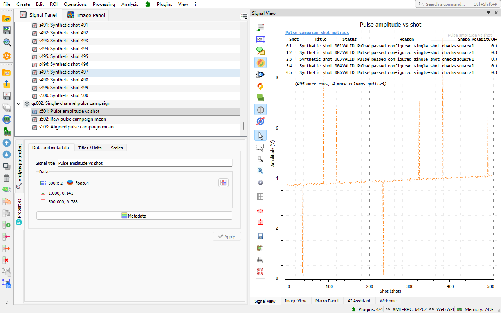

# Pulse & Transient Characterization

A [DataLab](https://datalab-platform.com/) plugin to analyze repeated pulse acquisitions: shot quality, stability, step response, delay between channels and pulse-height spectra.



> **Status: Alpha.** The methods are validated on synthetic data with known truth. They do not claim compliance with a standard.

## Methods

Each method comes with a generated demonstration.

| Method | Question | Guide |
| --- | --- | --- |
| Single-channel pulse campaign | Which shots are valid, and what is the representative pulse? | [Pulse campaign](doc/pulse-campaign.md) |
| Shot-to-shot stability | How large are the timing jitter, the drifts and the energy fluctuations, and when do they change? | [Shot-to-shot stability](doc/shot-stability.md) |
| Step response | What are the rise time, overshoot, settling time, ringing and bandwidth of a system? | [Step response](doc/step-response.md) |
| Two-channel delay and jitter | What is the delay between two channels, and which part of the jitter is common? | [Two-channel delay](doc/two-channel-delay.md) |
| Pulse-height spectrum | What is the energy calibration and resolution of a detector? | [Pulse-height spectrum](doc/pulse-height-spectrum.md) |

## Installation

- **DataLab Desktop:** the plugin needs DataLab 1.4 or later (not released yet). Download the wheel (`.whl`) attached to the latest [release](https://github.com/DataLab-Platform/datalab-pulse-characterization/releases) and install it with **Plugins > Configure plugins... > Install plugins**. This also works with the standalone version of DataLab. In a Python environment, you may instead install it with pip:

  ```bash
  pip install git+https://github.com/DataLab-Platform/datalab-pulse-characterization.git
  ```

- **DataLab-Web:** [DataLab-Web](https://github.com/DataLab-Platform/web) bundles the plugin. There is nothing to install.

## First Run

1. In the signal panel, choose **Plugins > Pulse & Transient Characterization > Open demo campaign**.
2. Choose **Run pulse campaign...** in the same menu.
3. Accept the parameters.

DataLab adds the amplitude versus shot with a per-shot metrics table, and the raw and aligned mean pulses. The **Applications** catalog, opened from the welcome page, offers the same path in one click. See [Getting started](doc/getting-started.md).

## Oscilloscope Simulator

The **Oscilloscope simulator** acquires laser pulses, amplifier steps or delayed pulse pairs through a time base, vertical scales and an ADC, with a live view. Its acquisitions are ready for the methods. See [Oscilloscope simulator](doc/simulator.md).


## Documentation

- [Documentation index](doc/README.md)
- [Contributing](CONTRIBUTING.md)
- [Changelog](CHANGELOG.md)

## License

BSD 3-Clause, see [LICENSE](LICENSE).
