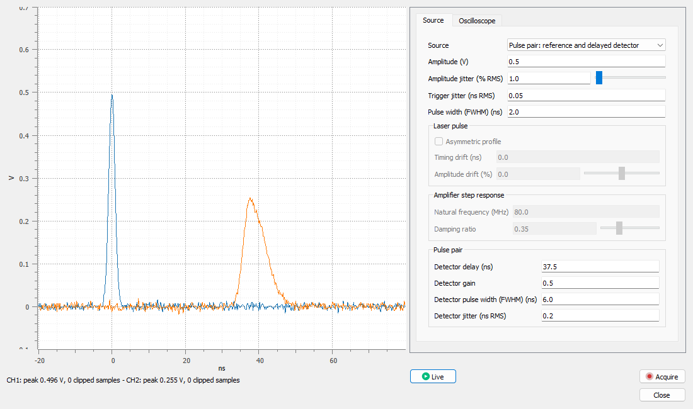

# Oscilloscope Simulator

[← Documentation index](README.md)

The **Oscilloscope simulator** acquires laser pulses, amplifier steps or delayed pulse pairs through a time base, vertical scales and an ADC, with a live view of the screen. Its acquisitions carry the metadata that the methods expect. Use it to learn the methods and to check a workflow: it does not replace a real bench.

## Use the Simulator

Open it from the **Tools** section of the Pulse page of the **Applications** catalog, or with **Plugins > Pulse & Transient Characterization > Oscilloscope simulator...** in the signal panel. It works the same way in DataLab Desktop and DataLab-Web.

- Every change of a setting refreshes the screen. Below it, a summary gives the peak of each channel and its number of clipped samples.
- **Live** refreshes the screen continuously. Each refresh is a new trigger, so jitter and noise show as on a real oscilloscope.
- **Acquire** records a series of triggers and adds them to the workspace, in a new group. The window stays open.

## Settings

Connect a source first (**Source** tab), then set the oscilloscope (**Oscilloscope** tab). Settings that do not apply to the selected source are greyed out.

| Group | Settings |
| --- | --- |
| Source | Laser pulse seen by a photodiode (Gaussian or asymmetric, with optional time and amplitude drifts), amplifier step response (natural frequency and damping ratio), or pulse pair (reference on CH1, delayed and wider detector pulse on CH2). For every source: amplitude, amplitude jitter and trigger jitter. The pulse pair adds the detector delay, gain, width and jitter |
| Horizontal | Time base (ns/div, ten divisions), sample rate, trigger position (part of the record before the trigger, at t = 0) |
| Vertical | Scale (V/div, eight divisions) and offset of CH1 and CH2, ADC resolution, input noise |
| Acquisition | Triggers per acquisition, random seed |

- The ADC codes the screen only: a trace that leaves the screen is clipped, then quantized on 2^bits levels.
- Times are in ns and voltages in V. The offset is the voltage at the center of the screen.
- The seed and the acquisition number fix the noise and jitter: the same settings give the same acquisitions in a new session.
- One acquisition holds at most 5 million samples, all signals together, to fit in the browser memory of DataLab-Web.

## Acquired Signals

Signals are named `CH1 shot 001`, `CH1 shot 002`, and so on; with a pulse pair, the CH2 signals follow. They carry these metadata keys, under `plugin.org.datalab.pulse-characterization.`:

- `shot`: the trigger number, from 1;
- `channel`: `CH1` or `CH2`;
- `synthetic` and `simulation_seed`: the simulated origin.

| Source | Methods |
| --- | --- |
| Laser pulse | [Single-channel pulse campaign](pulse-campaign.md), [shot-to-shot stability](shot-stability.md) |
| Amplifier step response | [Step response](step-response.md) |
| Pulse pair | [Two-channel delay and jitter](two-channel-delay.md) |

The two-channel method measures the delay between 50 % crossings. With the default asymmetric detector pulse, this delay is shorter than the delay between peaks set in the source.

## Limits

The trigger is external and synchronized with the source: there is no trigger level, slope or rearm logic. There is no bandwidth limit, no probe model, and no acquisition mode other than a series of single triggers.
